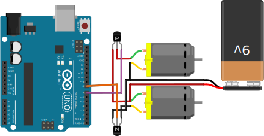

# IOT - Utiliser les mosfets en Arduino

Les MOSFETs (Metal Oxide Semiconductor Field Effect Transistor), ou transistor à effet de champ à grille isolée, sont souvent utilisés, pas que dans l'IOT, afin de fournir une plus grande puissance électrique.

On peut grossièrement les vulgariser comme des interrupteurs où la commande est électrique, et sans partie méchanique à l'intérieur. Sinon, on parlerai de relais.

## Comment ça marche ?

Un MOSFET possède 3 pattes :

 - *Base/Grille* : Patte permettant l'activation ou la désactivation, 
 - *Collecteur/Drain* : Là où rentre l'énergie,
 - *Émetteur/Source* : Là où sort l'énergie.

Lorsque l'on envoie une tension sur la grille, celle-ci permet au collecteur d'être connecté à l'émetteur. Plus d'informations sur [Wikipédia](https://fr.wikipedia.org/wiki/Transistor_%C3%A0_effet_de_champ_%C3%A0_grille_m%C3%A9tal-oxyde#Principe_de_fonctionnement).

Le silicium :

*[Souce](https://zeptobars.com/en/read/NXP-PMST3904-NPN-BJT)*

Dans ce cas précis, on peut déterminer que les deux gros ronds sont le collecteur et l'émetteur. La grille est la partie orange pastel du circuit.

## Avec un Arduino

